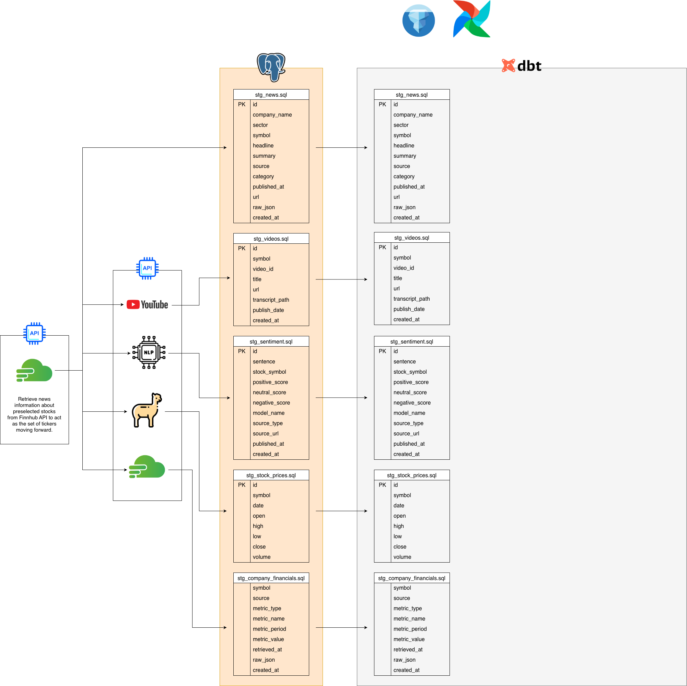

# Alphyra

Alphyra is an end-to-end data pipeline for **stock-focused sentiment analysis**, combining news articles and YouTube videos into a unified, sentence-level sentiment dataset.  

The project is designed to mirror real-world data engineering and analytics workflows: ingestion, deduplication, storage, NLP inference, and downstream analysis readiness.

This system was intentionally built **from scratch**, without relying on pre-cleaned datasets, in order to expose and solve real pipeline problems such as duplicate handling, partial failures, schema evolution, and idempotent processing.

---

## Project Motivation

Most sentiment analysis projects stop at:
- Pulling data once
- Running a model
- Saving results

Alphyra was built to go further:
- Handle **ongoing ingestion**
- Avoid **duplicate re-processing**
- Support **multiple data sources**
- Preserve **traceability** between raw data and sentiment outputs

The end goal is to create a sentiment foundation that can support:
- Stock research
- Event-driven analysis
- Longitudinal sentiment tracking
- Future dashboards and trading tools

---

## Data Architecture Diagram (work in progress)

## High-Level Architecture (to be added in SOON)

The system is designed so **raw data is never overwritten** and sentiment can always be recomputed if models or logic change.

---

## Database Schema (Raw Layer)

### `raw.news`
Stores cleaned financial news articles.

| Column | Description |
|------|------------|
| symbol | Stock ticker |
| headline | Article headline |
| summary | Article summary (required for sentiment) |
| source | Publisher |
| url | Unique article identifier |
| published_at | Publish timestamp |
| raw_json | Original API payload |

Articles without usable summaries are **filtered at ingestion** to avoid downstream failures.

---

### `raw.videos`
Stores YouTube videos mapped to stocks.

| Column | Description |
|------|------------|
| symbol | Stock ticker |
| video_id | YouTube video ID |
| url | Video URL |
| transcript_path | Local transcript storage |
| is_copy | Indicates reused video across stocks |
| publish_date | Video publish date |

A single video may be associated with **multiple stocks** if discussed in the same content.  
This is handled explicitly rather than treated as a duplicate error.

---

### `raw.sentiment`
Sentence-level sentiment output for **both news and videos**.

| Column | Description |
|------|------------|
| sentence | Text chunk |
| positive_score | FinBERT positive probability |
| neutral_score | FinBERT neutral probability |
| negative_score | FinBERT negative probability |
| model_name | NLP model used |
| source_type | `News` or `YouTube` |
| source_url | Article URL or video URL |
| published_at | Original publish time |

No stock symbol is stored here intentionally — stock mapping is derived via joins to `raw.news` or `raw.videos`.

---

## Sentiment Analysis

- Model: **FinBERT**
- Granularity: **sentence-level**
- Inference:
  - Batched
  - CPU-safe
  - Inference-only (`torch.no_grad()`)

Sentences are:
- Cleaned
- Validated
- Filtered before inference
- Guaranteed to maintain alignment with sentiment outputs

Failures in individual sentences do **not** corrupt batch alignment.

---

## Deduplication Strategy

Deduplication is handled at **multiple layers**, by design:

### News
- Articles are uniquely identified by `url`
- Already-processed articles are skipped
- Empty or invalid summaries never enter the pipeline

### Videos
- Videos are deduplicated by `video_id`
- If a video already exists:
  - It may still be **copied** to another stock (`is_copy = true`)
  - Transcripts and sentiment are reused
- Prevents redundant downloads and inference

This allows correct handling of:
> “One video discusses multiple stocks”

---

## Pipeline Behavior Guarantees

- Idempotent ingestion  
- No duplicate sentiment rows  
- Safe re-runs  
- Schema evolution tolerance  
- Partial failure isolation  

The system can be run repeatedly without corrupting or duplicating data.

---

## Current Status

**Implemented**
- News ingestion
- Video ingestion
- Sentence-level sentiment
- Deduplication logic
- Postgres-backed raw layer
- Dockerized execution

**Planned**
- DAG orchestration (Airflow)
- Dashboard / visualization layer
- Aggregated sentiment metrics
- Event-based sentiment alerts

---

## Tech Stack

- Python
- Pandas
- PyTorch
- HuggingFace Transformers
- PostgreSQL
- Docker
- YouTube Data API
- Finnhub API

---

## Why This Project Matters

This project reflects real-world data work:
- Debugging data assumptions
- Handling empty edge cases
- Designing schemas that survive change
- Balancing correctness vs performance
- Building systems that can grow

Alphyra is not a one-off analysis — it is a **foundation**.

---

## Author

Built by **Ben Grigsby**  
Statistics @ UC Davis  
Focused on Data Engineering, Machine Learning, and Applied Analytics